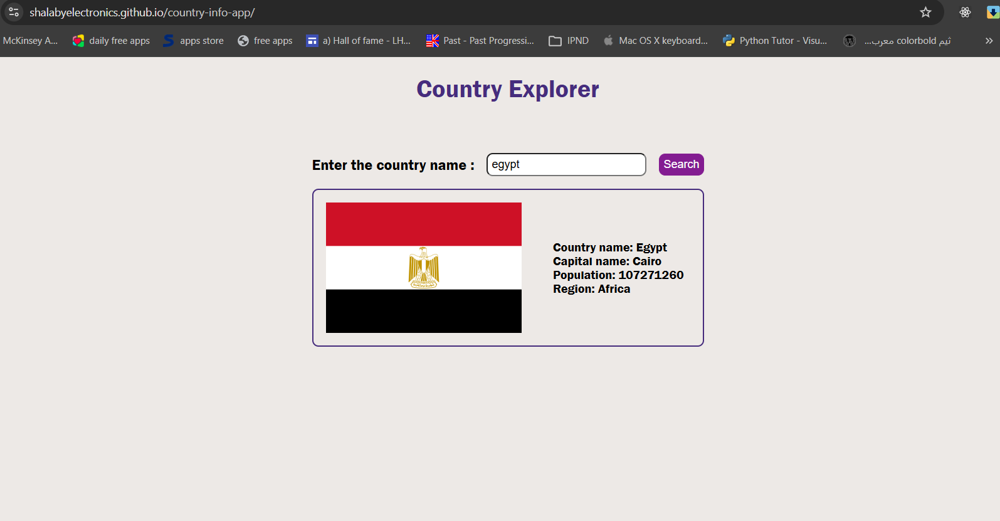

# Country Info APP 

## What is Country info app ?
- It is a small app that get a country data using a `restcountries.com/v3.1` free API, so the user can get any country details by typing the country name. for now user can get country and capital name, Population, Region and flag image as well.

## Tech used:
- HTML
- CSS
- JavaScript
- REST API

## Live Demo:
- [https://shalabyelectronics.github.io/country-info-app/](https://shalabyelectronics.github.io/country-info-app/)

## To run it locally:
- Clone the repo and open with VS Code
- Use the Live Server extension to run it locally
- Note: internet connection required for the API